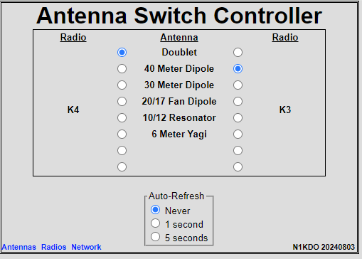
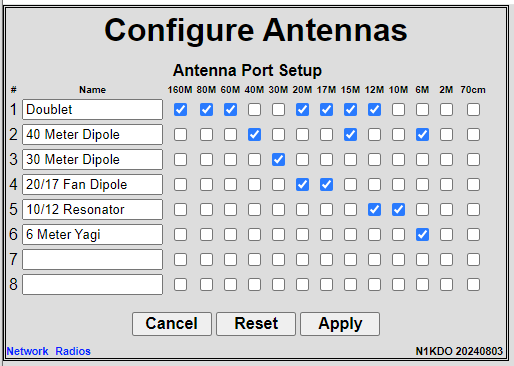
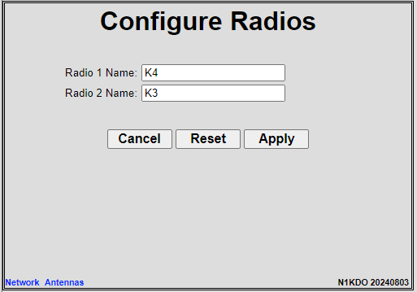
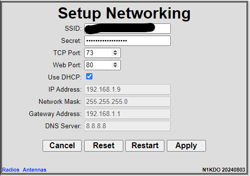

# N1KDO IOT Antenna Switch Control

This project is intended to operate a remote antenna switch.  

It supports (up to) a 2-radio, 8-antenna switch, however, my target is an Array 
Solutions "SixPak" which is a 2-radio, 6-antenna remote switch.  

Why IOT?  That's really about WiFi.  The board uses WiFi to connect to your network,
which means that only power needs to be protected from Zeus, not 14 +/- wires.  Also, 
I plan to build "band-decoders" that will interface with my Elecraft HF radios.  
That work has not yet started, but the plan is that the band decoders will detect
a band change on the radio and send a API request to the switch control board to 
request an antenna for that band.  If no antenna is available, the band decoder
will activate the K3s' "TX INHIBIT" lead and prevent the radio from transmitting
into the wrong antenna or no antenna.

This runs on the [N1KDO 16 Relays Board](https://github.com/n1kdo/16-relays/)

## Board Image

## "Control Panel" Image

## Antenna Setup UI

## Radio Setup UI

## Network Setup UI

