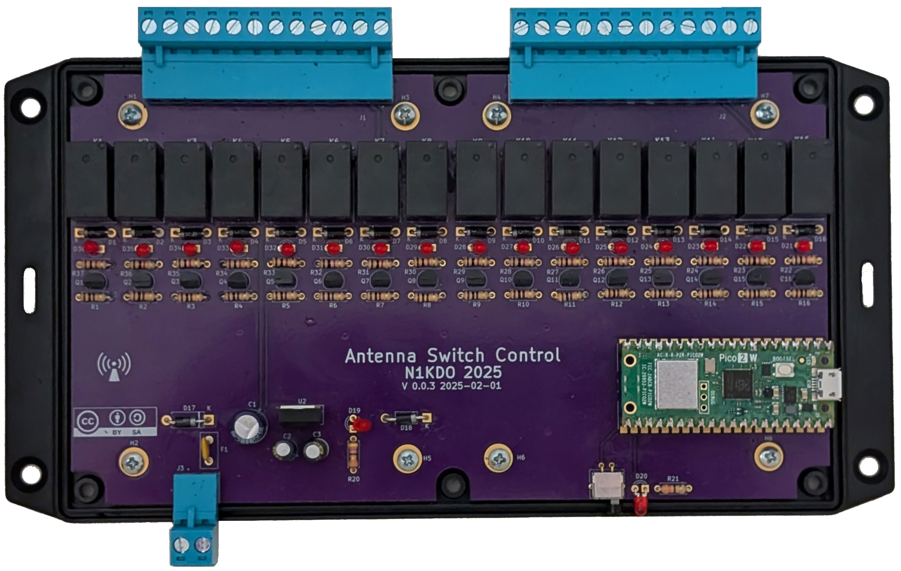

# N1KDO IOT Antenna Switch Control

This project is intended to operate a remote antenna switch.  

It supports (up to) a 2-radio, 8-antenna switch.  2x6 switches for fine.  Active-hi
or active low compatible.

Why IOT?  That's really about WiFi.  The board uses WiFi to connect to your network,
which means that only the power leads need to be protected from Zeus, not 14 +/- wires.  

I have built matching "band-decoders" to interface with my Elecraft HF radios.  
The band decoders detect a band change on the radio and send a API request to 
the switch control board to request an antenna for that band.  If no antenna 
is available, the band decoder will activate the K3s' "TX INHIBIT" lead and 
prevent the radio from transmitting into the wrong antenna or no antenna.

The Band Selector (radio interface) is [here](https://github.com/n1kdo/BandSelector) &mdash;
This is the other component for this project, you will need _two_ &mdash;  one for each radio.

See the Ecosystem diagram, below.

## Ecosystem

## Bill of Materials

* [Bill of Materials](BOM.md)
* The approximate cost to buy these parts is about $106.

## Board Image

# UI Images

## "Control Panel" Image

## Antenna Setup UI

## Radio Setup UI

## Network Setup UI

n1kdo 20251124