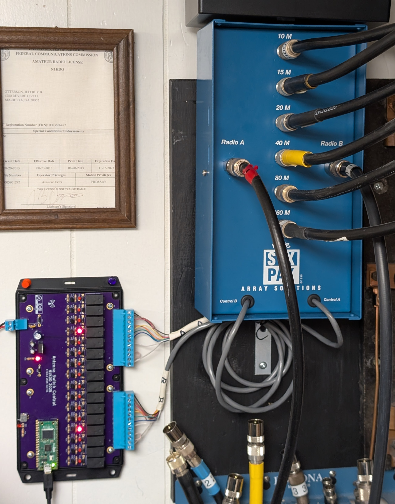

# N1KDO IOT Antenna Switch Control

This project is intended to operate a remote antenna switch.  

It supports (up to) a 2-radio, 8-antenna switch, however, my target is an Array 
Solutions "SixPak" which is a 2-radio, 6-antenna remote switch.  

Why IOT?  That's really about WiFi.  The board uses WiFi to connect to your network,
which means that only power needs to be protected from Zeus, not 14 +/- wires.  

I have built matching "band-decoders" to interface with my Elecraft HF radios.  
The band decoders detect a band change on the radio and send a API request to 
the switch control board to request an antenna for that band.  If no antenna 
is available, the band decoder will activate the K3s' "TX INHIBIT" lead and 
prevent the radio from transmitting into the wrong antenna or no antenna.

The Band Selector (radio interface) is [here](https://github.com/n1kdo/BandSelector) &mdash;
This is the other component for this project, you will need _two_ &mdash;  one for each radio.

## Bill of Materials

* [Bill of Materials](BOM.md)

## Board Image

## Interfaced to Six Pak

(note that the hardware supports a 2x8 switch, too.)

# UI Images

## "Control Panel" Image

## Antenna Setup UI

## Radio Setup UI

## Network Setup UI

